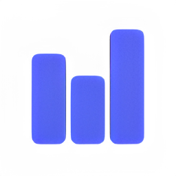

 # Tradex

Tradex is an open-source app that utilizes Electron and ReactJS to create a user-friendly platform for algorithmic trading. It integrates with the Tradestation API, allowing traders to automate their strategies and access real-time market data.


## Technology

**OS:** Windows (Linux/Mac TBD)

**Infrastructure:** Electron

**Client:** React, TailwindCSS

**Server:** Node

**Database:** TBD


## Installations

- Install Node [here...](https://nodejs.org/en/download/current)
- Install Git [here...](https://git-scm.com/downloads)

    
## Environment Variables

To run this project, you will need to add the following environment variables:

**Tradestation:**

`TS_CLIENT_ID`

`TS_CLIENT_SECRET`


## Run Locally

Clone the project

```bash
  git clone https://github.com/g-ulrich/Tradex.git 
```

Go to the project directory

```bash
  cd Tradex
```

Start the server

```bash
  npm start
```


## Authors

- [@g-ulrich ](https://www.github.com/g-ulrich)


## Support

For support, email gabriel.ulrich@aol.com.

